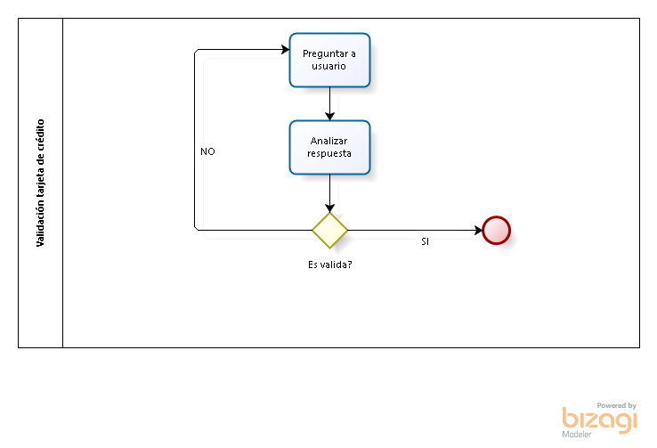

var pregunta; se crea una variable que es la que alojará la respuesta de los usuarios
var item; 
function isValidCard(){ se crea la funnción que se pide en el enunciado del ejercicio

pregunta = prompt('Ingrese el n\u00famero de su tarjeta de cr\u00E9dito por favor'); //preguntar al usuario número de tarjeta

//pregunta.split([''][])
var bunker = pregunta.split("").map(Number); //split separa una cadena. Map, convierte la cadena en Array

var array; se crea array para contener el resultado de los pares

for (var i = 0; i < bunker.length; i++) {
  item = bunker.pop(); //POP corta última posición
  array = bunker.splice(i, 0, item); //splice retorna: (i) donde se inicia, (0) lo que se quita, (item), la variable
  										//como pop cortó en una iteración, cuando se retorna item, se devuelven las cifras inversas.
  
}

var pares = []; //push sólo sirve para array por eso se crea uno

for (var i = 0; i < bunker.length; i++) {
	if (i % 2 == 0){ //así se realiza la búsqueda de números pares, el % es una función llamada residuo
pares.push(i); //con push enviamos la información de una "caja" a otra, se pide que i envíe a pares ya que se hace la búsqueda desde la iteración

  }
}

var multiplica;

/*
for (var i = 0; i < pares.length; i++){
	multiplica = (i * 2);
	pares.push(i);

}
*/
No alcancé a terminar esta variable :/

}

isValidCard();

